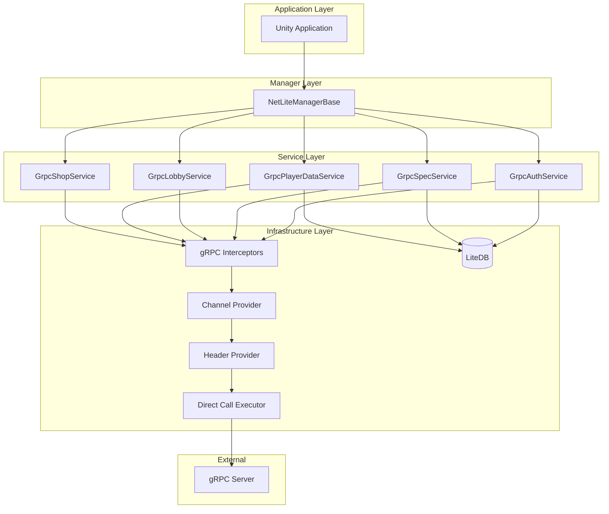
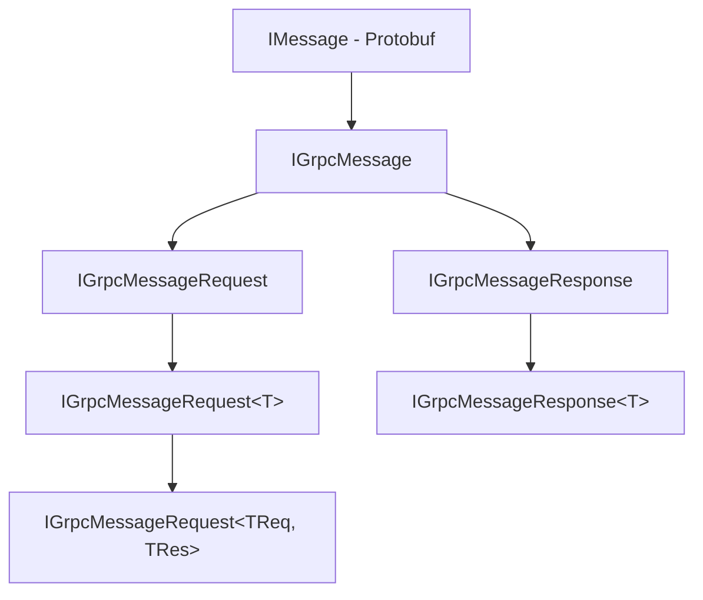

# NetLite Runtime 개발자 가이드

> **목적**: 이 문서는 NetLite 패키지의 내부 구조를 이해하고 개발/유지보수할 때 참고하기 위한 개발자용 문서입니다.

## 📁 디렉토리 구조

```
Runtime/
├── Manager/              # 매니저 계층
│   ├── NetLiteManagerBase.cs
│   └── Modules/          # DI 컨테이너 모듈
├── Feat/                 # 기능 구현
│   ├── Grpc/            # gRPC 관련
│   │   ├── Services/    # gRPC 서비스 구현
│   │   ├── Interceptor/ # 요청/응답 가로채기
│   │   ├── GrpcChannelProvider.cs
│   │   ├── GrpcHeaderProvider.cs
│   │   └── GrpcDirectCallExecutor.cs
│   ├── DB/              # LiteDB 로컬 저장소
│   └── Logger/          # 로깅 시스템
├── Initialize/          # 초기화 파라미터
├── ProtoRoot/           # Proto 파일 생성 코드
├── Constants/           # 상수 정의
├── Utils/               # 유틸리티
├── Interfaces.cs        # 핵심 인터페이스
├── Exceptions.cs        # 예외 정의
├── Attributes.cs        # 커스텀 어트리뷰트
└── Delegates.cs         # 델리게이트 정의
```

## 🏗️ 아키텍처 개요



### 계층 설명

- **Manager Layer**: DI 컨테이너 기반으로 전체 생명주기 관리
- **Service Layer**: 각 도메인별 gRPC 서비스 제공
- **Infrastructure Layer**: gRPC 통신, 로컬 저장소, 로깅 등 공통 기능

## 🔑 핵심 컴포넌트

### NetLiteManagerBase

전체 생명주기를 관리하는 중앙 매니저입니다.

```csharp
// 초기화
var param = new NetLiteInitializeParam
{
    Address = "https://server.com:50051",
    EnabledLog = true,
    Store = StoreMap.GooglePlay
};
manager.Startup(param);

// 서비스 사용
var response = await manager.Auth.AuthenticateAsync(request);

// 종료 (앱 종료 시 자동 호출됨)
manager.Shutdown();
```

**주요 프로퍼티**:

- `Auth`: 인증 서비스
- `Spec`: 사양(Game, Language 등) 서비스
- `Lobby`: 로비 서비스
- `PlayerData`: 플레이어 데이터 서비스
- `Shop`: 상점 서비스

### gRPC 서비스 구조

서비스 클래스에 `GrpcServiceAttribute`를 표시하면, SourceGenerator가 자동으로 `GrpcServiceBase`를 상속하는 코드를 생성합니다.

**중요**: 서비스 클래스는 반드시 `partial`로 정의해야 하며, `GrpcServiceBase`를 명시적으로 상속하면 안 됩니다.

```csharp
// SourceGenerator가 자동으로 GrpcServiceBase 상속 코드를 생성
[GrpcService(typeof(AuthService.AuthServiceClient))]
public partial class GrpcAuthService
{
    // Proto에서 생성된 클라이언트 사용
    // Interceptor를 통해 자동으로 헤더, 로깅, 세션 관리 등 처리
}
```

### Interceptor 체인

요청/응답은 다음 순서로 Interceptor를 통과합니다:

1. **GrpcRequestIdInterceptor**: 요청 ID 생성
2. **GrpcSendAndLoggerInterceptor**: 로깅
3. **GrpcSessionInterceptor**: 세션 토큰 관리
4. **GrpcSyncManifestInterceptor**: 매니페스트 동기화

## 🔧 개발 가이드

### 새로운 서비스 추가

1. **Proto 파일 정의** → Proto에서 C# 코드 생성
2. **서비스 클래스 생성**:

```csharp
[GrpcService(typeof(MyService.MyServiceClient))]
public class GrpcMyService : GrpcServiceBase
{
    public async Task<MyResponse> MyMethodAsync(MyRequest request)
    {
        return await CallAsync(request);
    }
}
```

3. **NetLiteManagerBase에 프로퍼티 추가**:

```csharp
public GrpcMyService MyService { get; private set; }
```

4. **GrpcModule에 등록** (DI 컨테이너에 자동 등록됨)

### Interceptor 추가

> ⚠️ **패키지 내부 전용**: Interceptor는 패키지 내부 및 테스트러너에서만 추가 및 사용 가능합니다. 외부 패키지 사용자는 접근할 수 없습니다.

```csharp
// 패키지 내부에서만 사용 가능
public class MyInterceptor : GrpcInterceptor
{
    public override int Order => 10; // 실행 순서
    
    public override async Task<TResponse> Handle<TRequest, TResponse>(
        TRequest request, 
        CallContext context, 
        CallContinuation<TRequest, TResponse> next)
    {
        // 전처리
        var response = await next(request, context);
        // 후처리
        return response;
    }
}
```

### 데이터베이스 사용

> ⚠️ **DI 주입 방식**: 데이터베이스는 싱글톤이 아니라 DI를 통해 주입받아 사용해야 합니다.

```csharp
// 생성자 주입을 통해 DB 사용
public class MyService
{
    private readonly CommonDB _commonDB;
    private readonly PlatformDB _platformDB;
    
    // DI 컨테이너가 자동으로 주입
    public MyService(CommonDB commonDB, PlatformDB platformDB)
    {
        _commonDB = commonDB;
        _platformDB = platformDB;
    }
    
    public void SaveData()
    {
        // CommonDB 사용
        _commonDB.SaveData("key", value);
        var data = _commonDB.GetData<MyData>("key");
        
        // PlatformDB 테이블 직접 접근
        var collection = _platformDB.GetCollection<MyTable>();
        collection.Insert(new MyTable { ... });
    }
}
```

## ⚠️ 주의사항

### 세션 관리

gRPC 호출 중 `StatusCode.Unauthenticated` 에러가 발생하면 세션이 만료된 것입니다.

```csharp
try
{
    var response = await service.CallAsync(request);
}
catch (RpcException ex) when (ex.StatusCode == StatusCode.Unauthenticated)
{
    // 세션 만료 - 초기 화면으로 이동하여 재로그인 필요
    NavigateToLoginScreen();
}
```

**세션 토큰 관리**: `GrpcSessionInterceptor`가 기존에 인증했던 세션 정보를 자동으로 gRPC 요청 헤더에 포함합니다. 세션이 만료된 경우 사용자가 직접 재인증을 수행해야 합니다.

### 인증 플랫폼

`Auth.AuthenticateAsync()`로 플랫폼별 인증을 수행합니다:

- **Android**: GPGS (Google Play Games Services)
- **iOS**: GameCenter
- **요구사항**: `tech-platform-auth` 패키지 필수

```csharp
var authRequest = new AuthenticateRequest 
{ 
    /* platform auth token */ 
};
var response = await manager.Auth.AuthenticateAsync(authRequest);

if (response.IsSuccess)
{
    // 인증 성공 - 세션 토큰 자동 저장됨
}
else
{
    // 인증 실패 처리
    Debug.LogError(response.Exception);
}
```

### 스레드 안전성

- 모든 비동기 작업은 `CancellationToken` 사용
- Unity 메인 스레드에서 UI 업데이트 필요
- `NetLiteManagerBase.Shutdown()` 호출 시 모든 작업 취소됨

### 로그 출력 조건

로그는 다음 조건을 **모두** 만족할 때만 출력됩니다:

1. `NetLiteInitializeParam.EnabledLog = true`
2. Development Build 또는 `_DEV` 스크립트 심볼 정의

```csharp
// 프로덕션 빌드에서는 로그가 출력되지 않음
#if DEVELOPMENT_BUILD || _DEV
    NetLogger.Log("This is logged");
#endif
```

## 🔍 인터페이스 계약

### 메시지 계층 구조



### 응답 객체 처리

모든 응답은 `IGrpcMessageResponse`를 구현합니다:

```csharp
public interface IGrpcMessageResponse
{
    ResponseStatus Status { get; }     // 서버 상태 코드
    bool IsSuccess { get; }            // 성공 여부
    Exception Exception { get; }       // 예외 정보
    void ThrowIfError();               // 오류 시 예외 발생
}
```

**사용 패턴**:

```csharp
// 패턴 1: IsSuccess 체크
var response = await service.CallAsync(request);
if (response.IsSuccess)
{
    // 성공 처리
}
else
{
    // 실패 처리: response.Status 또는 response.Exception 확인
}

// 패턴 2: ThrowIfError 사용
try
{
    var response = await service.CallAsync(request);
    response.ThrowIfError(); // 실패 시 예외 발생
    // 성공 처리
}
catch (ResponseStatusCodeException ex)
{
    // StatusCode 기반 오류 처리
}
catch (Exception ex)
{
    // 기타 오류 처리
}
```

### 예외 타입

- **`ResponseStatusCodeException`**: 서버 응답 상태 코드가 200이 아닌 경우
  - `StatusCode` 프로퍼티로 구체적인 상태 확인
- **`RpcException`**: gRPC 통신 오류
- **`OperationCanceledException`**: 작업 취소 (CancellationToken)

## 📝 코딩 규칙

- **XML 문서 주석**: 모든 public API에 필수
- **비동기 메서드**: `Async` 접미사 사용
- **IL2CPP 보호**: 리플렉션 사용 시 `[Preserve]` 어트리뷰트 추가

## 🧪 테스트 관련

### Unity Test Runner 사용

```csharp
[UnityTest]
public IEnumerator TestAuthenticate()
{
    // Setup
    manager.Startup(testParam);
    
    // Test
    var task = manager.Auth.AuthenticateAsync(request);
    yield return new WaitUntil(() => task.IsCompleted);
    
    // Assert
    Assert.IsTrue(task.Result.IsSuccess);
    
    // Cleanup
    manager.Shutdown();
}
```

### 생명주기 관리 주의

- 각 테스트마다 `Startup()` / `Shutdown()` 호출 필요
- `Shutdown()` 완료 전에 `Startup()` 호출 시 Assert 발생
- `IsStarted` 프로퍼티로 상태 확인 가능

## 🔗 참고 자료

- **Main README**: 패키지 사용 가이드
- **Source Generator**: 최상단 `Generators` 폴더 - gRPC 코드 자동 생성
