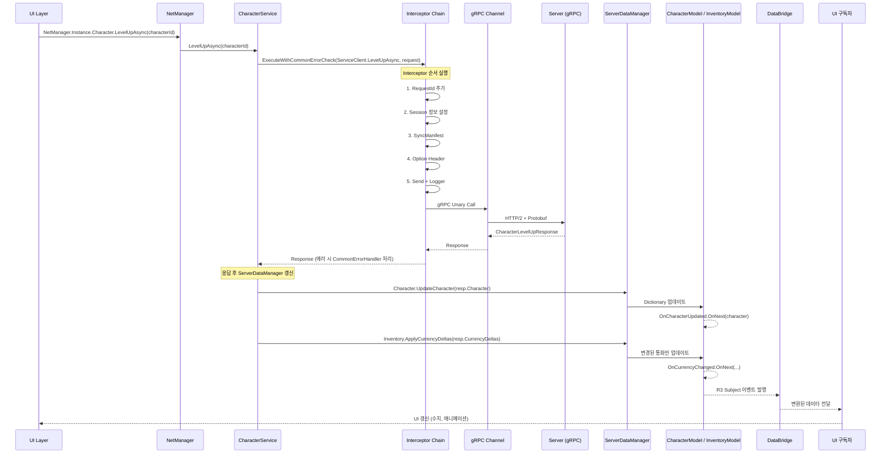

# 서버 통신 시퀀스 다이어그램

## 전체 흐름 (캐릭터 레벨업 예시)



## 계층 구조

```
UI (버튼 클릭 등)
 └→ NetManager.Instance.{Service}.{Method}Async()
     └→ GrpcServiceBase.ExecuteWithCommonErrorCheck()  [Source Generated]
         └→ Interceptor Chain (7단계)
             └→ gRPC Channel (HTTP/2 + TLS)
                 └→ Server
                     ↩ Response
         ↩ ServerDataManager.Instance.{Model}.Update(resp.Data)
             ↩ R3 Subject (OnChanged, OnUpdated 등)
                 ↩ DataBridge → UI 자동 갱신
```

## 핵심 설계 원칙

| 원칙 | 설명 |
|------|------|
| **서버 중심 델타 업데이트** | 클라이언트 독자 상태 변경 금지, 서버 응답으로만 갱신 |
| **명시적 갱신** | RPC 후 반드시 `ServerDataManager` 수동 호출 |
| **R3 반응형 UI** | Model → Subject → DataBridge → UI 구독 체인 |
| **Source Generator** | `[GrpcService]` + `partial class` → `ExecuteWithCommonErrorCheck` 자동 생성 |

## Interceptor Chain 순서

1. `GrpcRequestIdInterceptor` — 요청 ID
2. `GrpcSessionInterceptor` — 세션 정보
3. `GrpcSyncManifestInterceptor` — 매니페스트 동기화
4. `GrpcOptionHeaderInterceptor` — 커스텀 헤더
5. `GrpcSendAndLoggerInterceptor` — 전송 + 로깅
6. `GrpcStreamDefaultHeaderInterceptor` — 스트림 헤더
7. `GrpcStreamLoggerInterceptor` — 응답 로깅

## gRPC 서비스 패턴

```csharp
[GrpcService(typeof(Tech.Hive.V1.CharacterService.CharacterServiceClient))]
public partial class CharacterService
{
    public async UniTask<CharacterLevelUpResponse> LevelUpAsync(uint characterId, CancellationToken ct = default)
    {
        var resp = await ExecuteWithCommonErrorCheck(
            ServiceClient.LevelUpAsync,
            new CharacterLevelUpRequest { CharacterId = characterId },
            cancellationToken: ct
        );

        if (resp is { IsSuccess: true })
        {
            ServerDataManager.Instance.Character.UpdateCharacter(resp.Character);
            ServerDataManager.Instance.Inventory.ApplyCurrencyDeltas(resp.CurrencyDeltas);
        }

        return resp;
    }
}
```

## ServerDataManager 모델

```csharp
public class ServerDataManager : Singleton<ServerDataManager>
{
    public CharacterModel Character { get; }
    public InventoryModel Inventory { get; }
    public ElpisModel Elpis { get; }
    public BattleModel Battle { get; }
    public PlayerDataModel PlayerData { get; }
    public CommanderSkillModel CommanderSkill { get; }
    public DeckModel Deck { get; }
    public GuideMissionModel GuideMission { get; }
    public EventModel Event { get; }
    public QuestModel Quest { get; }
    public TrialDungeonModel TrialDungeon { get; }
}
```

## NetManager 서비스 목록

```csharp
public class NetManager : NetLiteManagerBase
{
    public CharacterService Character { get; }
    public BattleService Battle { get; }
    public PlayerInventoryService Inventory { get; }
    public ElpisService Elpis { get; }
    public PostService Post { get; }
    public DeckService Deck { get; }
    public PlayerService Player { get; }
    public CommanderSkillService CommanderSkill { get; }
    public GuideMissionService GuideMission { get; }
    public SummonService Summon { get; }
    public EventService Event { get; }
    public QuestService Quest { get; }
    public TrialDungeonService TrialDungeon { get; }
    // ...
}
```

## 서버 주소

| 환경 | 주소 |
|------|------|
| 개발 | `https://gwbm013-grpc.dev.cookappsgames.com:443` |
| 상용 | `https://gwbm013-grpc.cookappsgames.com:443` |
| 로컬 | `http://100.91.148.60:50051` |
